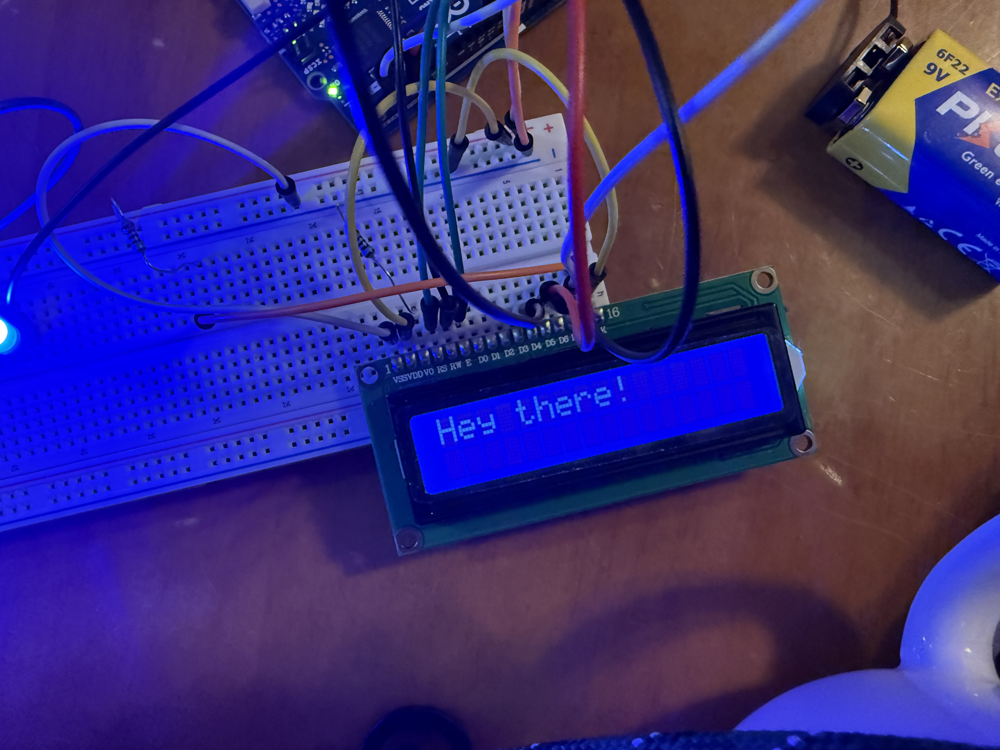
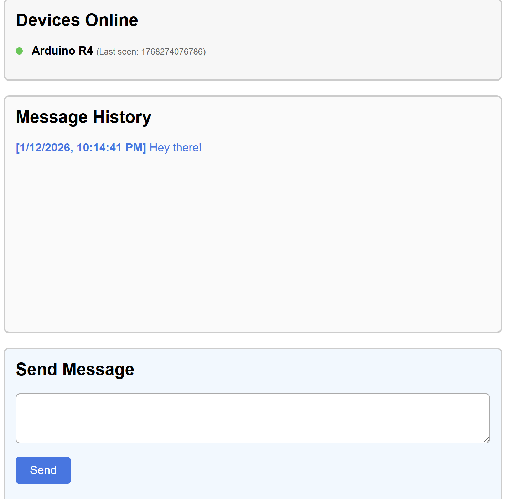

# This is a list of parts I will need. Please read them
## if you dont buy them i will be sad

# ✧ More important ✧
- [Raspberry pi pico](https://www.adafruit.com/product/6087)
- [lcd screen](https://www.adafruit.com/product/399)

## - Less important stuff -
- [NFC stickers](https://www.walmart.com/ip/100-PCS-NFC-Tags-Sticker-with-NTAG213-Chip-Blank-NFC-Stickers-Adhesive-Labels-RFID-Tags-Rewritable-144-Bytes-Memory/5262089087?wmlspartner=wlpa&selectedSellerId=102618560&selectedOfferId=F33E0EC3B1253003998364E59693547E&conditionGroupCode=1)

# Here is the rundown of what I'm doing:
I'm creating a wifi based tex display, which displays a message based on a local server I host. To do this, I will be using wifi enabled microcontrolers to pull messages from text.

The microcontroller pulls a message off a local server, and onto the lcd screen. A light is used to indicate connection to wifi. I'm thinking about using buttons to put the device into sleep mode, to save energy.

## What is done so far?

I have the basic framework of how this project will work. I will be creating the code for Raspberry Pi Pico, ESP32, and other microcontrollers.